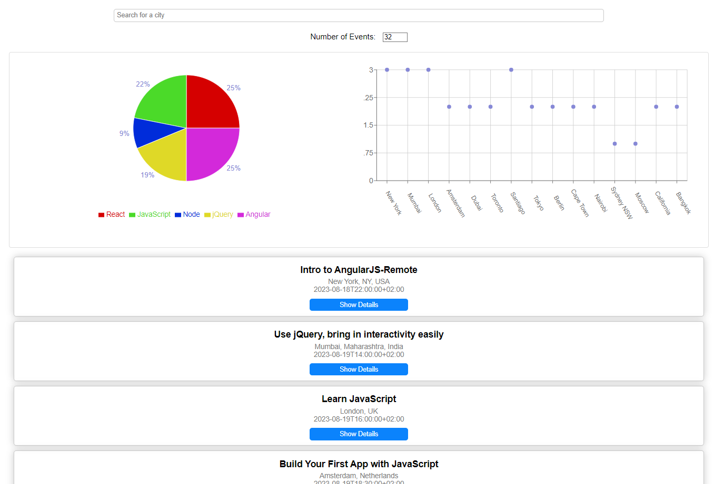

# Meet App

Welcome to Meet App, a progressive web application (PWA) designed to help you explore upcoming events in various cities. This serverless application leverages the power of React and follows a test-driven development (TDD) approach to deliver a seamless user experience. By integrating the Google Calendar API, Meet App provides real-time event data to keep you informed and connected.

## Key Features

- Filter Events by City: Easily search and discover events based on your preferred city.
- Show/Hide Event Details: Expand or collapse event details to view additional information as needed.
- Specify Number of Events: Customize the number of events displayed to suit your preference.
- Use the App When Offline: Access and view previously fetched event data even without an internet connection.
- Add an App Shortcut to the Home Screen: Install Meet App as a shortcut on your device's home screen for quick access.
- Visualize Event Details: Gain insights and understanding through charts depicting upcoming events in different cities.

## User Stories

1. As a user, I want to explore events in specific cities so that I can plan my attendance accordingly.
2. As a user, I want the flexibility to view event details on demand, allowing me to focus on relevant information.
3. As a user, I want to control the number of events displayed at once, enabling me to manage the amount of information.
4. As a user, I want the ability to access event data even when offline, ensuring uninterrupted browsing.
5. As a user, I want to add the app as a shortcut on my home screen, enabling quick and convenient access.
6. As a user, I want to visualize event distribution across cities, providing a comprehensive overview of upcoming events.

## Scenarios:

### Feature 1: Filter Events By City
Scenario 1: When I haven't specified a city, display upcoming events from all cities.
Scenario 2: When I search for a city, show relevant suggestions to aid my selection.
Scenario 3: After selecting a city, present a list of events specific to that location.

### Feature 2: Show/Hide Event Details
Scenario 1: By default, event details are hidden, providing a concise view of the events.
Scenario 2: When I choose to view event details, expand the event card to display additional information.
Scenario 3: If I prefer to hide event details, collapse the expanded event card to maintain an overview.

### Feature 3: Specify Number of Events
Scenario 1: When I haven't specified a number, display 32 events as the default count.
Scenario 2: Allow me to customize the number of events shown to align with my preference.

### Feature 4: Use the App When Offline
Scenario 1: When I'm offline, load and display cached event data to ensure continuous access.
Scenario 2: If I modify search settings while offline, inform me about the connectivity requirement.

### Feature 5: Add an App Shortcut to the Home Screen
Scenario 1: Provide an option for me to install Meet App as a shortcut on my device's home screen.

### Feature 6: Visualize Event Details
Scenario 1: Present a chart illustrating the distribution of upcoming events across different cities.

#### Usage of Serverless Functions
This project utilizes serverless functions to enhance scalability and efficiency:
-installing dependencies,
-configuring the provider,
-customizing the function's logic,
-deploying,
-testing,
and monitor performance.

Serverless functions enable efficient task handling without traditional server management.

##### Thank You!